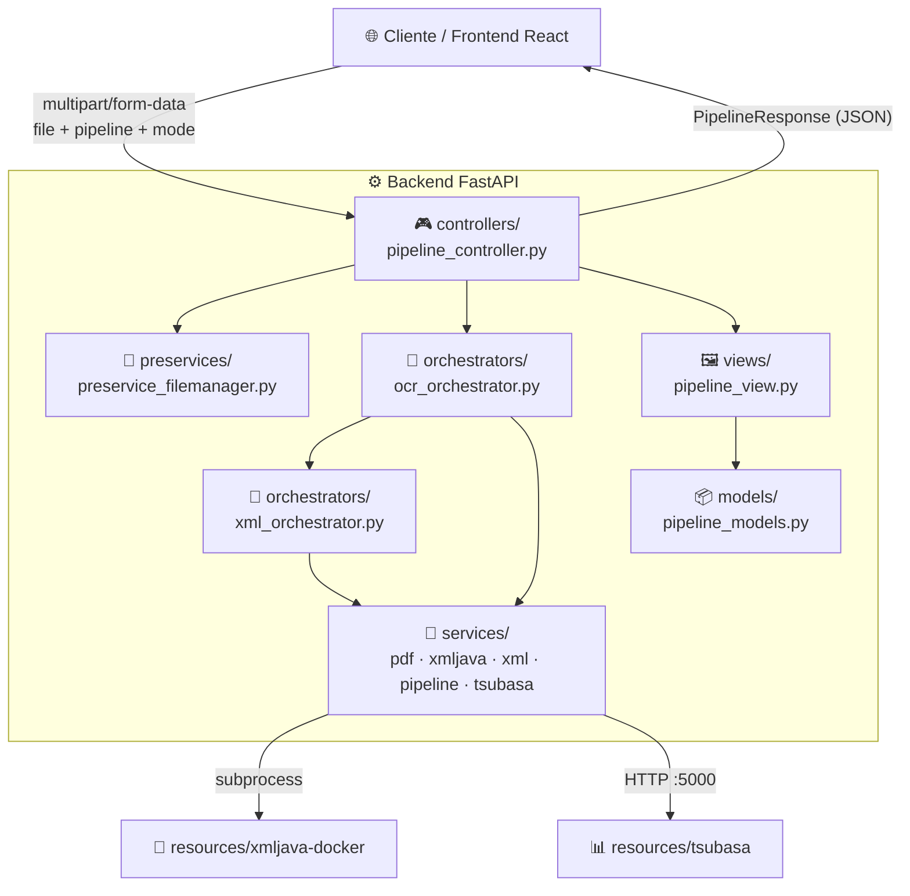
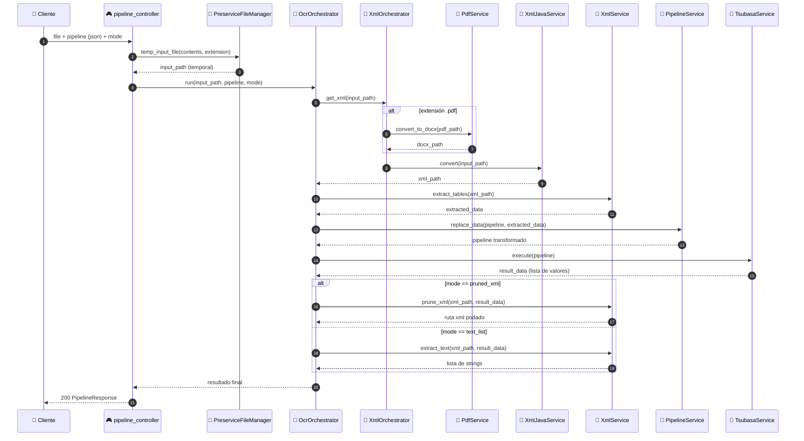

# 🐉 RedDragon

Servicio que convierte documentos (`doc`, `docx`, `xls`, `xlsx`, `pdf`) a XML, extrae su contenido, ejecuta un **pipeline de transformación de datos** contra un motor externo (**Tsubasa**) y devuelve el resultado final como XML podado o como lista de strings.

Incluye un backend en **FastAPI** y un frontend en **React + Vite + TailwindCSS** para probar el flujo end-to-end.

---

## 📐 Arquitectura

RedDragon sigue una **arquitectura en capas estilo MVC**, con dos capas intermedias (`preservices` y `orchestrators`) entre el controller y los services de bajo nivel. Cada capa solo llama hacia abajo, nunca al revés.



### Flujo de `POST /execute_pipeline`



📄 Detalle extendido en [`docs/architecture.md`](docs/architecture.md).

---

## 🗂️ Estructura del proyecto

```
RedDragon/
├── main.py                   # 🚀 bootstrap: FastAPI + lifespan + uvicorn
├── controllers/               # 🎮 rutas HTTP
├── preservices/                # 📁 manejo de archivos temporales
├── orchestrators/               # 🧭 coordinan varios services
├── services/                     # 🔧 lógica atómica (pdf, xml, xmljava, pipeline, tsubasa)
├── models/                        # 📦 schemas Pydantic
├── views/                          # 🖼️ formato de respuesta
├── resources/                       # 📄 binarios (xmljava-docker, tsubasa)
├── scripts/start.sh                  # 🐧 arranque nativo en Linux (sin Docker)
├── docs/architecture.md               # 📚 arquitectura detallada
├── frontend/                            # ⚛️ React + Vite + TailwindCSS
│   └── src/
│       ├── components/{atoms,molecules,organisms,templates}/  # 🧩 Atomic Design
│       ├── hooks/                                                # 🪝 lógica reutilizable
│       ├── data/                                                  # 📋 listas/config estáticos
│       └── pages/                                                  # 📄 páginas
└── Dockerfile                                                        # 🐳 build multi-etapa
```

---

## ✅ Requisitos

- 🐍 Python ≥ 3.11 + [`uv`](https://docs.astral.sh/uv/)
- 🟢 Node.js + npm (solo para el frontend)
- 🐳 Docker (opcional, recomendado)
- 🐧 Linux (los binarios en `resources/` son ELF; en Windows solo funcionan dentro de Docker/WSL)

---

## ▶️ Cómo levantarlo

### 🐳 Con Docker (recomendado)

```bash
docker build -t reddragon .
docker run -p 8000:8000 -p 5000:5000 reddragon
```

El `Dockerfile` es **multi-etapa**: una etapa `node:22-alpine` compila el frontend (`npm run build`) y la etapa final (Python/uv) copia solo el `dist/` resultante — FastAPI lo sirve como estático en `/`, mientras la API queda en `/execute_pipeline`.

### 🐧 Nativo en Linux (sin Docker)

```bash
bash scripts/start.sh
```

Instala dependencias de Python (`uv sync`) y del frontend, compila el frontend, da permisos de ejecución a los binarios de `resources/` y arranca el servidor.

### 🛠️ Desarrollo (frontend y backend por separado)

```bash
# Backend
uv run main.py

# Frontend (con hot reload, en otra terminal)
cd frontend
npm install
npm run dev
```

---

## ⚙️ Variables de entorno

| Variable | Descripción | Default |
|---|---|---|
| `REDDRAGON_HOST` | Host de uvicorn | `0.0.0.0` |
| `REDDRAGON_PORT` | Puerto de la API | `8000` |
| `TSUBASA_HOST` | Host del binario `tsubasa` | `127.0.0.1` |
| `TSUBASA_PORT` | Puerto del binario `tsubasa` | `5000` |

---

## 🔌 API

### `POST /execute_pipeline`

`multipart/form-data`:

| Campo | Tipo | Descripción |
|---|---|---|
| `file` | archivo | `doc`, `docx`, `xls`, `xlsx` o `pdf` |
| `pipeline` | string (JSON) | grafo de nodos (`graph.nodes.*`) a ejecutar en Tsubasa |
| `mode` | string | `"pruned_xml"` o `"text_list"` |

**Respuesta** (`200`):

```json
{
  "filename": "reporte.docx",
  "mode": "text_list",
  "result": ["..."]
}
```
